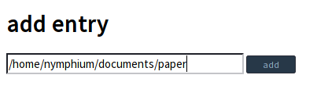

Pnyao
===

Pnyao is a pdf management tool

## usage[alpha versoin]
### ready
run server and go http://localhost:9000

```
$ sbt run
```

### set
Put a directory name and click "add" button



### go
There are displayed contents. 
You can change title/author metadata from the page and add memo, tag(, which is WIP).


### WIP functions
- tag
- delete entry from DB
- UI

# license
MIT
