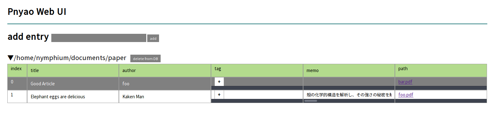
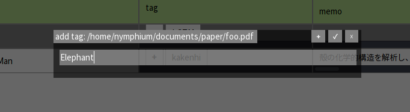
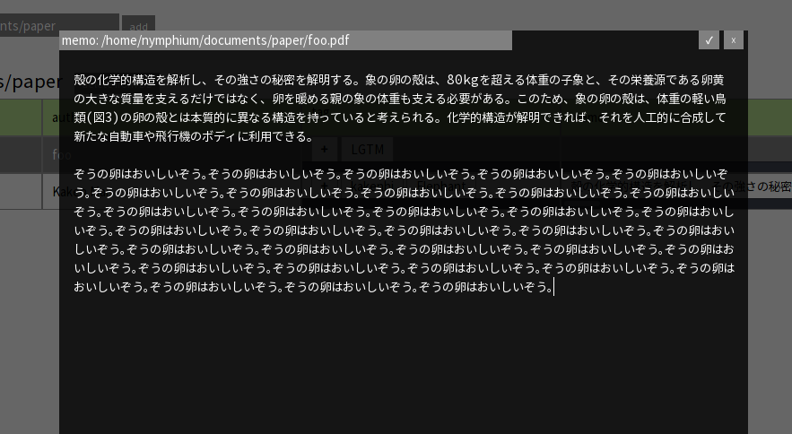

Pnyao
===

[](https://travis-ci.org/Nymphium/pnyao)



Pnyao is a pdf management system and can manipulate from the Web UI.

# usage
## Ready
Run server

```shell-session
$ sbt run
```

or install pnyao on your PC and run with systemd

```shell-session
$ ./install.sh
$ systemctl --user enable pnyao-server.service && \
  systemctl --user start pnyao-server.service
```

and go http://localhost:9000

## Set
Put a directory name and click "add" button


## GO
There are displayed contents. 
You can change title/author metadata of the PDF from the page, and add memo and tag.






# DB
DB is located at `~/.pnyaodb` by default, which is JSON file.

```json
[
  {
    "path": "/path/to/directory/of/documents",
    "contents": [
      {
      "title": "PDF Title or empty string",
      "author": "Author or empty string",
      "path": "/absolute/path/to/pdf",
      "tag": ["tag list"],
      "memo": "memo or empty string"
      }
    ]
  }
]
```

DB file is updated when pnyao server shuts down, and simultaneously each `title`s and `author`s are wrote to the PDF's metadata.

# Future work
- Search and sort by Tags

# license
MIT
